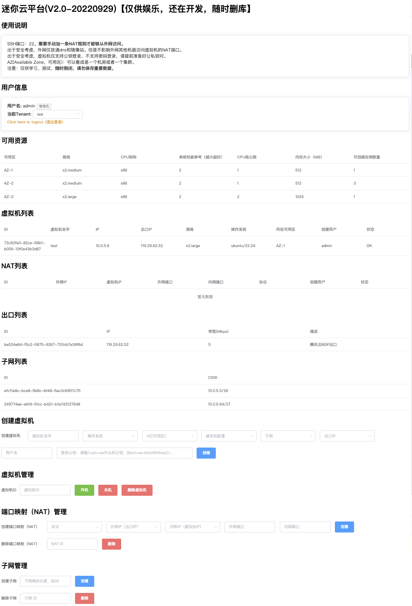

# miniCloud

一个迷你云平台，可以创建虚拟机。做这个项目的目的是学习流表的设计和使用，所以功能着重在网络实现上，对于别的功能不大重视，能用就行。

流量使用OVS流表转发。NAT通过iptables实现。流表和配置下发全部通过SSH命令实现。

特色：可以使用云主机的公网IP作为出口。（如果使用云主机，需要把云主机和计算节点通过隧道打通，然后分配service_ip，我使用wireguard做隧道）



## 部署文档

这里使用Debian10。

节点分三类：`网关节点`、`计算节点`、`特殊节点`。`特殊节点`目前包含`交换节点`和`DHCP节点`，`交换节点`和`DHCP节点`可以部署在同一台机上。

我的测试环境有6台机器，2台网关节点（阿里云一台+腾讯云一台），3台计算节点，1台特殊节点。整个云overlay网段范围为`192.168.20.0/22`（分配给虚拟机的网段）。

另外需要一台`管理机`用来运行本项目的程序。我直接把特殊节点当管理机使用了。所有节点都需要添加管理机的SSH公钥，实现免密码登录，并且可以sudo免密码执行命令。（这部分操作不介绍了）

机器列表如下：

```
网关节点：
nnode1-az1 192.168.11.2
nnode1-az2 192.168.12.2
计算节点：
cnode1-az1 192.168.13.2
cnode2-az1 192.168.13.3
cnode1-az2 192.168.14.2
特殊节点：
snode1-az1 192.168.10.2
```

所有节点都需要安装：`apt install openvswitch-switch; ovs-vsctl add-br br0`

计算节点另外安装：`apt install qemu-kvm libvirt-clients libvirt-daemon-system virtinst`

DHCP节点另外安装：`apt install isc-dhcp-server`

网络节点需要执行命令：`iptables -t nat -A POSTROUTING -s 192.168.20.0/22 -o eth0 -j SNAT --to-source 10.0.8.12` 这里的`192.168.20.0/22`为云网段范围，`10.0.8.12`为网络节点的ip。

虚拟机使用的存储，只要qemu支持就可以，具体可以修改代码里`create_vm`部分的命令。需要预先准备一个虚拟机镜像。这里我使用的镜像名叫`ubuntu-template.qcow2`，放在计算节点的`/mnt`目录下（也可以用NFS，挂在到同一目录，我是用NFS的）。多系统镜像目前没做，只要改一点代码就可以了。

### 计算节点配置

新建文件`ovs.xml`：

```
<network>
  <name>ovs</name>
  <uuid>c4b321c3-ab75-4232-bb1f-ca4f92881d77</uuid>
  <forward mode='bridge'/>
  <bridge name='br0'/>
  <virtualport type='openvswitch'/>
</network>
```

执行命令：

```
virsh net-define ovs.xml && virsh net-autostart ovs && virsh net-start ovs
```

### DHCP节点配置

修改`/etc/dhcp/dhcpd.conf`为如下配置：

```
option domain-name "gcc.ac.cn";
option domain-name-servers 114.114.114.114;
default-lease-time 600;
max-lease-time 7200;
ddns-update-style none;
include "/etc/dhcp/net.conf";
include "/etc/dhcp/vm.conf";
```

执行命令：`touch /etc/dhcp/net.conf && touch /etc/dhcp/vm.conf`

### 初始化数据库和测试

执行`db.py`，初始化数据库。

执行`controller.py`里的如下内容：（参数看函数描述改）

```python
print(add_gateway("139.9.62.22", "139.9.62.22", "192.168.11.2", "192.168.0.133", 1, "华为云"))
print(add_gateway("119.29.62.52", "119.29.62.52", "192.168.12.2", "10.0.8.12", 5, "腾讯云"))
print(add_special_node("192.168.10.2", "192.168.10.2", "switch,dhcp"))
print(add_host("192.168.13.2", "192.168.13.2", "AZ-1", 32, 48))
print(add_host("192.168.13.3", "192.168.13.3", "AZ-1", 32, 48))
print(add_host("192.168.14.2", "192.168.14.2", "AZ-2", 128, 256))
print(create_subnet(27))
```

如果上面都没问题，就可以试试创建虚拟机：

```python
print(create_vm("d6b72035-5a0c-5ef8-af39-8955e338185b", "139.9.62.22", "4C8G", "test"))
```

创建虚拟机成功后可以看看虚拟机是否正常启动并获得了正确的ip地址，然后测试能否出外网。

单台虚拟机正常后，可以尝试创建多一个子网，两个子网的虚拟机互相ping看能否通。（正常设计是通的，并且不过网关，直达）

要使用前端和API，执行`main.py`即可。

## 参考资料

MAC地址：https://en.wikipedia.org/wiki/MAC_address

OVS会`skipping output to input port`，所以虚拟机不会收到自己的广播报文。

```
# 查看虚拟机对应的物理网卡
virsh domiflist 192.168.20.11 | grep 02:6e:1d:4e:69:ef | awk '{print $1}'
```

## 网桥设计

### 宿主

```bash
# vxlan端口
ovs-vsctl add-port br0 {interface} -- set interface {interface} type=vxlan options:local_ip={ip} options:key=flow options:remote_ip=flow
# 到switch的端口
ovs-vsctl add-port br0 {interface} -- set interface {interface} type=vxlan options:remote_ip={ip} options:key=flow
```

### dhcp

```bash
# vxlan端口
ovs-vsctl add-port br0 {interface} -- set interface {interface} type=vxlan options:local_ip={ip} options:key=flow
# 配上网关ip作为dhcp服务器ip
ip addr add {gateway_ip}/{mask} dev br0
```

### switch

```bash
# 与所有宿主的vxlan隧道（用于广播）
ovs-vsctl add-port br0 {interface} -- set interface {interface} type=vxlan options:remote_ip={ip} options:key=flow
```

### 网关

```bash
# vxlan端口
ovs-vsctl add-port br0 {interface} -- set interface {interface} type=vxlan options:local_ip={ip} options:key=flow
# 配上网关ip
ip addr add {gateway_ip}/{mask} dev br0
```

## 流表设计

|table|priority|匹配项|action|备注|
|---|---|---|---|---|
|table=0|priority=20|dl_dst=ff:ff:ff:ff:ff:ff|actions="resubmit(,50)"|广播流量|
|table=0|priority=10|dl_dst=00:00:00:00:00:00/01:00:00:00:00:00|actions="resubmit(,10)"|单播流量|
|table=0|priority=10|dl_dst=01:00:00:00:00:00/01:00:00:00:00:00|actions="resubmit(,50)"|组播流量|
|table=0|priority=0| |actions=drop|默认流|
|table=10|priority=5|dl_src={vm_mac},dl_dst=12:00:00:FF:FF:FF|actions=load:"{gateway_service_ip_hex}->NXM_NX_TUN_IPV4_DST[]",vxlan-int|vm到网关的流量(网关mac地址固定为12:00:00:FF:FF:FF)|
|table=10|priority=15|dl_dst={vm_mac}|actions=load:"{subnet_tun_id_hex}->NXM_NX_TUN_ID[]",load:"{vm_host_ip_hex}->NXM_NX_TUN_IPV4_DST[]",vxlan-int|同子网vm到远程vm的流量，填入tun_id和dst后从vxlan-int接口发出去
|table=10|priority=15|dl_dst={vm_mac}|actions={vm_interface}|同子网vm到本地vm的流量，从对应接口发出去|
|table=10|priority=10|ip,nw_dst={vm_ip}|actions=mod_dl_src:"12:00:00:FF:FF:FF",mod_dl_dst:"{vm_mac}",load:"{subnet_tun_id_hex}->NXM_NX_TUN_ID[]",load:"{vm_host_ip_hex}->NXM_NX_TUN_IPV4_DST[]",vxlan-int|不同子网vm到远程vm的流量|
|table=10|priority=10|ip,nw_dst={vm_ip}|actions=mod_dl_src:"12:00:00:FF:FF:FF",mod_dl_dst:"{vm_mac}",{vm_interface}|不同子网vm到本地vm的流量|
|table=10|priority=5| |actions=local|网关节点，把流量发到本地网桥（然后NAT）|
|table=10|priority=0| |actions=drop|默认流|
|table=50|priority=20|arp,arp_tpa={gateway_ip},arp_op=1|actions=move:"NXM_OF_ETH_SRC[]->NXM_OF_ETH_DST[]",mod_dl_src:"12:00:00:FF:FF:FF",load:"0x02->NXM_OF_ARP_OP[]",move:"NXM_NX_ARP_SHA[]->NXM_NX_ARP_THA[]",load:"0x120000FFFFFF->NXM_NX_ARP_SHA[]",move:"NXM_OF_ARP_SPA[]->NXM_OF_ARP_TPA[]",load:"{gateway_ip_hex}->NXM_OF_ARP_SPA[]",in_port|vm到网关的arp请求（宿主代答）|
|table=50|priority=15|udp,tp_src=68,tp_dst=67,in_port={in_port}|actions=load:"{subnet_tun_id_hex}->NXM_NX_TUN_ID[]",load:"{dhcp_server_hex}->NXM_NX_TUN_IPV4_DST[]",vxlan-int|DHCP报文，发往DHCP服务器|
|table=50|priority=10|in_port={in_port}|actions=load:"{subnet_tun_id_hex}->NXM_NX_TUN_ID[]","resubmit(,60)"|根据inport设置tunid|
|table=50|priority=10|in_port=vxlan-sw,tun_id={subnet_tun_id_hex}|actions={out_ports}|inport是vxlan则根据tunid发到本地端口|
|table=50|priority=10|udp,tp_src=68,tp_dst=67,tun_id={subnet_tun_id_hex}|actions={out_ports}|DHCP报文，发往本地vm|
|table=50|priority=0| |actions="resubmit(,60)"|默认流|
|table=60|priority=0| |actions="clone(resubmit(vxlan-sw,50)),vxlan-sw"|普通节点，复制一个包修改in_port到50表（发到本地的端口），同时发送到switch|
|table=60|priority=10| |actions=all|switch节点，广播到除入接口外所有接口 (flood其实也行，因为目前端口没有配置no-flood)|
